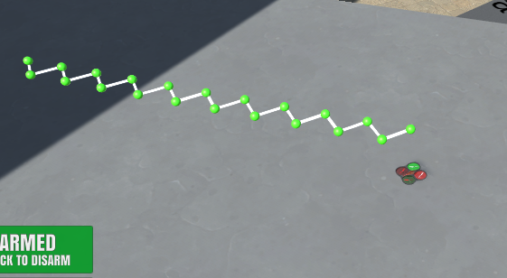

## Project: 3D Motion Planning

---

# Required Steps for a Passing Submission:
1. Load the 2.5D map in the colliders.csv file describing the environment.
2. Discretize the environment into a grid or graph representation.
3. Define the start and goal locations.
4. Perform a search using A* or other search algorithm.
5. Use a collinearity test or ray tracing method (like Bresenham) to remove unnecessary waypoints.
6. Return waypoints in local ECEF coordinates (format for `self.all_waypoints` is [N, E, altitude, heading], where the drone’s start location corresponds to [0, 0, 0, 0].
7. Write it up.
8. Congratulations!  Your Done!

## [Rubric](https://review.udacity.com/#!/rubrics/1534/view) Points

---
### Writeup / README

#### 1. Provide a Writeup / README that includes all the rubric points and how you addressed each one.  You can submit your writeup as markdown or pdf.  

You're reading it! Below I describe how I addressed each rubric point and where in my code each point is handled.

### Explain the Starter Code

#### 1. Explain the functionality of what's provided in `motion_planning.py` and `planning_utils.py`
planning_utils.py contains utility functions and an enum class to assist motion_planning.py path planning for the drone. 
The enum class Action represents moving the drone in a NESW direction as a tuple, with the third value being a constant
cost. The functions are create_grid which returns a grid representation of the 2d configuration space, valid_actions 
which restricts actions if they would result in leaving the grid or hitting an obstacle and a_star which implements
the A* search algorithm.

motion_planning.py is a extension of the last projects backyard flyer code. It has a motion planning class that has a 
plan_path function that needs completing for this project. The class also contains functions for each of the transitions:
landing, waypoint, armed, manual etc and callback functions for state, velocity and local position.

Currently when motion_planning.py is run the drone follows a zig zag route.

### Write up of Path Planning Algorithm

#### 1. Set your global home position
- I modified the plan_path function to read the first line of the colliders.csv file, extracting lat0 and lon0 as floating-point values.
- These values were then used with the self.set_home_position() method to set the global home position.

#### 2. Set your current local position
- I retrieved the drone's current position in geodetic coordinates (self._latitude, self._longitude, and self._altitude) and converted this to local coordinates using the global_to_local() utility function.
- The code now sets the start point for the path planning algorithm using this dynamically determined local position, ensuring that planning always begins from the drone's actual location

#### 3. Set grid start position from local position
- I replaced the hardcoded map center with the dynamically calculated local position obtained from the drone's geodetic coordinates.

#### 4. Set grid goal position from geodetic coords
- I added functionality to allow the goal position to be set based on user-defined latitude and longitude values.
- The choose_random_goal() function was introduced to generate a goal point within the boundaries of the map, ensuring it is at least a minimum distance from the start point.
- The goal point is then converted to local coordinates and used in the planning algorithm, allowing for more flexible and dynamic goal setting.

#### 5. Modify A* to include diagonal motion (or replace A* altogether)
- Original A* implementation has been replaced with networkx A* implementation as planning is now done with a graph rather than a grid.

#### 6. Cull waypoints 
- Once a path is found the path is pruned by collinearity and then by the bresenham algorithm.
Helper functions, prune_path_collinearity and prune_path_bresenham both used by combined_pruning, to facilitate this are provided in planning_utils.py.
- The pruned path, represented as way points, are then passed to the drone.

#### Additional Functionality
- The code implements the probabilistic roadmap algorithm as below:
  - 2.5d polygons, presently with a fixed height though I plan on improving this in the future, are created from the colliders data.
These are stored in a region tree spatial data structure to allow for more efficient querying. Polygon and rtree creation are facilitated by functions in polygon.py.
  - A number of Graph nodes are then randomly spread in free space around the polygon obstacles. Node creation is facilitated by functions in nodes.py. Nodes are checked to ensure they do not collide with obstacles using the collides function in planning_utils.py. 
  - We now create a 3D view of the world with polygons and nodes using the create_nodes_and_graph() function.
  - The above 3 processes, creating the polygons, nodes and graph, all occur in main before the API connection or Drone class are created.
this is due to the computation time being too excessive across the API and causing a timeout, hence this processing must occur locally with the results being passed to the MotionPlanning class for path finding.
- If path planning fails, i.e. a path cannot be found between the node nearest the start point and the node nearest the goal point, then self.stop() is called on the drone
which terminates the connection and triggers a new set of nodes and a new graph to be created. This new graph can then be checked for a valid path. The start point and local goal persist between graph creations.
- Waypoints have headings added to them via the calculate_heading() function found in planning_utils.py
- Deadbands of 8m are set for each waypoint enabling the Drone to fly more smooth patterns between waypoints, see local_position_callback()

